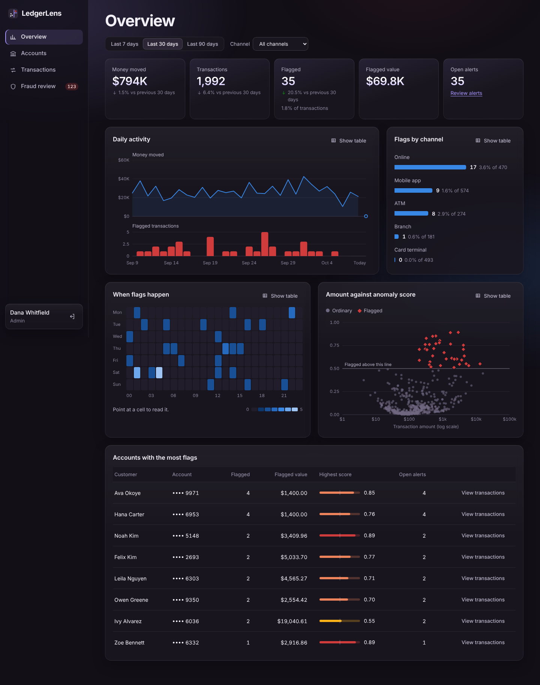

# LedgerLens — Banking Transaction & Fraud Analytics System

A small banking console: manage accounts, move money, and have every transaction
scored for fraud by an Isolation Forest. Flagged transactions land in a review
queue, and an analytics dashboard shows where and when unusual activity happens.



| Part | Stack | Folder |
|---|---|---|
| Web app | React 18, Vite, react-spring | `client/` |
| API | Node.js, Express, JWT auth | `server/` |
| Database | PostgreSQL | `db/` |
| Fraud model | Python, scikit-learn Isolation Forest, Flask | `ml/` |

## Run it

You need Node 18.17+, Python 3.10+ and PostgreSQL 13+ (or Docker).

**1. Database**

```bash
docker compose up -d          # Postgres on :5432 with schema + demo data loaded
```

Without Docker, create a database and load the two files yourself:

```bash
createdb ledgerlens
psql ledgerlens -f db/schema.sql -f db/seed.sql
```

**2. Fraud scoring service** (port 5001)

```bash
cd ml
python -m venv .venv && source .venv/bin/activate    # Windows: .venv\Scripts\activate
pip install -r requirements.txt
python app.py
```

**3. API** (port 4000)

```bash
cd server
cp .env.example .env          # set DATABASE_URL and a JWT_SECRET
npm install
npm run train                 # trains the model and scores every transaction
npm run dev
```

**4. Web app** (port 5173)

```bash
cd client
npm install
npm run dev
```

Open http://localhost:5173 and sign in with a demo account (password `demo1234`):

- `admin@ledgerlens.demo`: staff console, including retraining the model
- `analyst@ledgerlens.demo`: staff console without retraining
- `customer@ledgerlens.demo`: customer banking, limited to that customer's own accounts

## What is in the app

- **Overview**: money moved, flagged counts, daily activity, flags by channel,
  an hour-by-weekday heatmap, amount against anomaly score, and the accounts
  with the most flags. One date and channel filter scopes everything.
- **Accounts**: balances with a 30-day trend, open an account, freeze or unfreeze.
- **Transactions**: searchable ledger; record deposits, withdrawals, card
  payments and transfers. Each new transaction is scored on the spot and the
  dialog shows the verdict and the reasons.
- **Customer banking**: a customer signs in to see their own balances and
  activity, send money to another account number, or make a payment. They never
  see scores or other customers.
- **Fraud review**: alerts strongest first, with plain-language reasons.
  Confirm (optionally freezing the account) or dismiss. The model panel shows
  how it was trained and lets an admin retrain with a different sensitivity.

To watch the model react, use **Move money → Card payment**, open "Where and
how it was made", and enter a large amount from another country on a device
name the account has never used.

## How the fraud model works

The Isolation Forest is unsupervised: it is never shown fraud labels. It scores
how easy a transaction is to separate from the rest using 12 signals computed
per account, such as how far the amount is from that account's usual amounts,
time of day, burst of activity in the last hour, location away from home, and a
device not seen before (`ml/features.py`).

The scoring service is stateless. The API reads transactions from PostgreSQL,
sends them to the service, and writes scores and alerts back
(`server/src/fraud.js`). If the service is down, money still moves and the
transaction is simply left unscored.

The demo data plants 130 anomalies of four kinds. Those labels are used only to
grade the model. With the default settings it flags 123 of 6,128 transactions,
at 76% precision and 72% recall. It catches night-time cash-out bursts and
foreign new-device purchases well, and misses about half of the "one large
wire, nothing else odd" cases — a fair picture of what this method can do.

Train from a CSV without the API: see the top of `ml/cli.py`.

## API

All routes are under `/api` and need `Authorization: Bearer <token>` except login.

| Method | Path | Purpose |
|---|---|---|
| POST | `/auth/login` | Sign in, returns a token |
| GET | `/accounts`, `/accounts/:id`, `/accounts/customers` | Read accounts and customers |
| POST | `/accounts` | Open an account |
| PATCH | `/accounts/:id/status` | Freeze or unfreeze |
| GET | `/transactions` | List with filters and paging |
| POST | `/transactions` | Deposit, withdrawal or card payment |
| POST | `/transactions/transfer` | Transfer between two accounts |
| GET | `/fraud/alerts` | Review queue |
| PATCH | `/fraud/alerts/:id` | Confirm, dismiss or reopen |
| GET | `/fraud/model` | Current model, metrics, score histogram |
| POST | `/fraud/retrain` | Retrain (admin only) |
| GET | `/analytics/overview` | Everything the dashboard shows |
| GET | `/me/accounts`, `/me/transactions` | Customer: own accounts and activity |
| POST | `/me/transfer`, `/me/payment` | Customer: send money or pay |

## Using Power BI instead of the built-in dashboard

Connect Power BI (or any BI tool) to PostgreSQL and load the view
`v_transactions_enriched`. It has one row per transaction with the account,
customer, anomaly score, flag and alert status already joined.

## Design notes

The interface borrows from three places:

- **react-spring** drives all motion: the sign-in animation, counting numbers,
  sliding selection markers, dialogs, toasts, chart draw-in and the alert queue.
- **React Bits**: `client/src/bits/` holds Split Text, Count Up and Spotlight
  Card, rewritten on react-spring so the project needs one animation library.
  To swap in the originals, copy them from reactbits.dev.
- **Watermelon UI / shadcn**: the dark dashboard layout and control styling.
  Styles are plain CSS with design tokens at the top of `client/src/styles.css`.

All times are stored and shown in UTC. Everything in the database is synthetic.

## Before using this for anything real

This is a demonstration project. It has no rate limiting, password reset,
audit log or database migrations, and the session token is kept in
localStorage.
"# Banking-Transaction-Fraud-Analytics-System" 
"# Banking-Transaction-Fraud-Analytics-System" 
